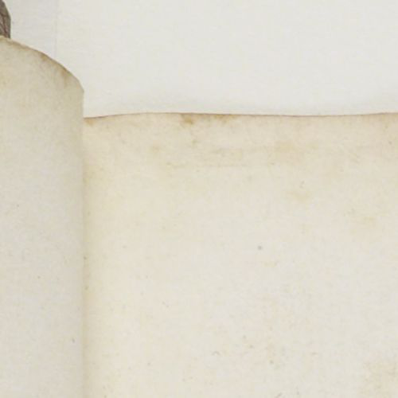
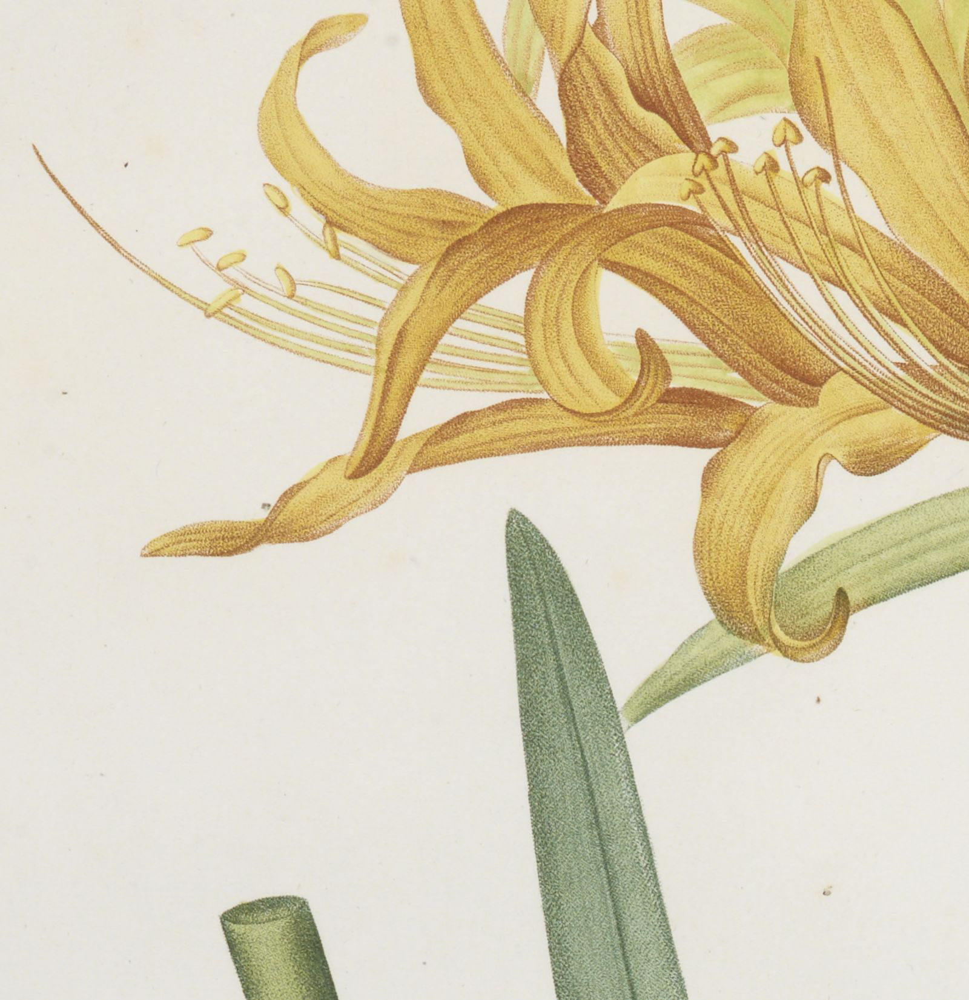

```r
library(bnfimage)
```

The BnF Gallica image library contains thousands of freely accessible images of historical interests. It provides an Application Programming Interface to access it ([see their documentation](https://api.bnf.fr/api-iiif-de-recuperation-des-images-de-gallica#scroll-nav__1)). The access is possible through the [IIIF](https://iiif.io/) API. The goal of `bnfimage` is to let you access this API directly from R.

## Accessing Images - `bi_image()`

To get a specific image, you first need to get its identifier from Gallica.
The identifier is a string that begins with `ark:/`. It is accessible from browsing [Gallica](https://gallica.bnf.fr) as the URL of the object such as: `https://gallica.bnf.fr/ark:/12148/bpt6k10411495/f11.item#` giving the id `ark:/12148/bpt6k10411495/f11`.

### Single Image

To download a single image you can use the `bi_image()` with the identifier of the object:


```r
bi_image("ark:/12148/bpt6k10411495/f11")
```



This displays a small portion of the image as by default this functions only returns the top left corner of the image from 0 to 500px in both directions.

To get the full image you can use the argument `region` with the value `"full"`:


```r
bi_image("ark:/12148/bpt6k10411495/f11", region = "full")
```


Otherwise if you wan to crop a specific region in the image you can define it as length 4 numeric vector specifiying the coordinates of the top left most point and the bottom right point. For example if you want to extract the image from 1250px x and 1300px y to 1600px x and 1650px y you would call:


```r
bi_image("ark:/12148/bpt6k10411495/f11", region = c(1250, 1300, 1600, 1650))
```



To save the images you can use the function `image_write()` in the `magick`
package. `image_write()` can accept any image filetype:


```r
img = bi_image("ark:/12148/bpt6k10411495/f11",
               region = c(1250, 1300, 1600, 1650))

magick::image_write(img, "./my_image.png")
```

The second argument specifies the file path. Refer to the help of the function
through `?magick::image_write` to get an overview of all the arguments and uses.

### Multiple Images

To access several images you can use a list of identifier and wrap calls
to `bi_image()` using `lapply()`:


```r
several_ids = c("ark:/12148/bpt6k10411495/f11", "ark:/12148/bpt6k10411495/f13",
                "ark:/12148/bpt6k10411495/f15")

several_imgs = lapply(several_ids, bi_image, region = "full",
                      size = c(200, 500))

several_imgs
#> [[1]]
#> # A tibble: 1 x 7
#>   format width height colorspace matte filesize density
#>   <chr>  <int>  <int> <chr>      <lgl>    <int> <chr>  
#> 1 JPEG     200    500 sRGB       FALSE    13015 400x400
#> 
#> [[2]]
#> # A tibble: 1 x 7
#>   format width height colorspace matte filesize density
#>   <chr>  <int>  <int> <chr>      <lgl>    <int> <chr>  
#> 1 JPEG     200    500 sRGB       FALSE    10990 400x400
#> 
#> [[3]]
#> # A tibble: 1 x 7
#>   format width height colorspace matte filesize density
#>   <chr>  <int>  <int> <chr>      <lgl>    <int> <chr>  
#> 1 JPEG     200    500 sRGB       FALSE    11759 400x400
```

## Accessing Metadata - `bi_metadata()`

One interest of the BnF image library is the richness of the metadata associated
with an image. For the moment bnfimage only converts metadata to a giant list
to make it accessible.

### Single Image

Using a single image identifier you can retrieve the metadata of an image
through the function `bi_metadata()`. The first argument is the identifier of
the image as for `bi_image()`:


```r
met = bi_metadata("ark:/12148/bpt6k10411495/f11")

str(met, max.level = 1)
#> List of 13
#>  $ @id        : chr "https://gallica.bnf.fr/iiif/ark:/12148/bpt6k10411495/manifest.json"
#>  $ label      : chr "BnF, département Arsenal, GR FOL-30 (2)"
#>  $ attribution: chr "Bibliothèque nationale de France"
#>  $ license    : chr "https://gallica.bnf.fr/html/und/conditions-dutilisation-des-contenus-de-gallica"
#>  $ logo       : chr "https://gallica.bnf.fr/mbImage/logos/logo-bnf.png"
#>  $ related    : chr "https://gallica.bnf.fr/ark:/12148/bpt6k10411495"
#>  $ seeAlso    :List of 1
#>  $ description: chr "Les liliacées. Tome 2 / , par P.-J. Redouté. [Tome premier-] huitième"
#>  $ metadata   :List of 13
#>  $ sequences  :List of 1
#>  $ thumbnail  :List of 1
#>  $ @type      : chr "sc:Manifest"
#>  $ @context   : chr "http://iiif.io/api/presentation/2/context.json"
```

The metadata contains much information on the actual image as well as its
context.

### Multiple Images

Similarly as for `bi_image()` to access the metadata of several images you can
wrap the calls to `bi_metadata()` through a list of identifiers using
`lapply()`:


```r
several_met = lapply(several_ids, bi_metadata)

str(several_met, max.level = 2)
#> List of 3
#>  $ :List of 13
#>   ..$ @id        : chr "https://gallica.bnf.fr/iiif/ark:/12148/bpt6k10411495/manifest.json"
#>   ..$ label      : chr "BnF, département Arsenal, GR FOL-30 (2)"
#>   ..$ attribution: chr "Bibliothèque nationale de France"
#>   ..$ license    : chr "https://gallica.bnf.fr/html/und/conditions-dutilisation-des-contenus-de-gallica"
#>   ..$ logo       : chr "https://gallica.bnf.fr/mbImage/logos/logo-bnf.png"
#>   ..$ related    : chr "https://gallica.bnf.fr/ark:/12148/bpt6k10411495"
#>   ..$ seeAlso    :List of 1
#>   ..$ description: chr "Les liliacées. Tome 2 / , par P.-J. Redouté. [Tome premier-] huitième"
#>   ..$ metadata   :List of 13
#>   ..$ sequences  :List of 1
#>   ..$ thumbnail  :List of 1
#>   ..$ @type      : chr "sc:Manifest"
#>   ..$ @context   : chr "http://iiif.io/api/presentation/2/context.json"
#>  $ :List of 13
#>   ..$ @id        : chr "https://gallica.bnf.fr/iiif/ark:/12148/bpt6k10411495/manifest.json"
#>   ..$ label      : chr "BnF, département Arsenal, GR FOL-30 (2)"
#>   ..$ attribution: chr "Bibliothèque nationale de France"
#>   ..$ license    : chr "https://gallica.bnf.fr/html/und/conditions-dutilisation-des-contenus-de-gallica"
#>   ..$ logo       : chr "https://gallica.bnf.fr/mbImage/logos/logo-bnf.png"
#>   ..$ related    : chr "https://gallica.bnf.fr/ark:/12148/bpt6k10411495"
#>   ..$ seeAlso    :List of 1
#>   ..$ description: chr "Les liliacées. Tome 2 / , par P.-J. Redouté. [Tome premier-] huitième"
#>   ..$ metadata   :List of 13
#>   ..$ sequences  :List of 1
#>   ..$ thumbnail  :List of 1
#>   ..$ @type      : chr "sc:Manifest"
#>   ..$ @context   : chr "http://iiif.io/api/presentation/2/context.json"
#>  $ :List of 13
#>   ..$ @id        : chr "https://gallica.bnf.fr/iiif/ark:/12148/bpt6k10411495/manifest.json"
#>   ..$ label      : chr "BnF, département Arsenal, GR FOL-30 (2)"
#>   ..$ attribution: chr "Bibliothèque nationale de France"
#>   ..$ license    : chr "https://gallica.bnf.fr/html/und/conditions-dutilisation-des-contenus-de-gallica"
#>   ..$ logo       : chr "https://gallica.bnf.fr/mbImage/logos/logo-bnf.png"
#>   ..$ related    : chr "https://gallica.bnf.fr/ark:/12148/bpt6k10411495"
#>   ..$ seeAlso    :List of 1
#>   ..$ description: chr "Les liliacées. Tome 2 / , par P.-J. Redouté. [Tome premier-] huitième"
#>   ..$ metadata   :List of 13
#>   ..$ sequences  :List of 1
#>   ..$ thumbnail  :List of 1
#>   ..$ @type      : chr "sc:Manifest"
#>   ..$ @context   : chr "http://iiif.io/api/presentation/2/context.json"
```

## Accessing Both Images and Metadata - `bi_all_data()`

The `bi_all_data()` function can be used to quickly retrieve both the images as
well as the associated metadata of one or several images. The outputs stores the
identifier of an image in a column, the actual image in a second one, and the
associated metadata in a third one:


```r
bi_all_data(c("ark:/12148/bpt6k10411495/f11", "ark:/12148/bpt6k10411495/f12"))
#> # A tibble: 2 x 3
#>   identifier                   image      metadata         
#>   <chr>                        <list>     <list>           
#> 1 ark:/12148/bpt6k10411495/f11 <magck-mg> <named list [13]>
#> 2 ark:/12148/bpt6k10411495/f12 <magck-mg> <named list [13]>
```
