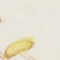
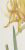
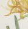
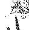

<!--
# Pre-render with
knitr::knit("vignettes/_bnfimage.Rmd", output = "vignettes/bnfimage.Rmd")
-->


```r
library(bnfimage)
```

The BnF Gallica image library contains thousands of freely accessible images of historical interests. It provides an Application Programming Interface to access it ([see their documentation](https://api.bnf.fr/api-iiif-de-recuperation-des-images-de-gallica#scroll-nav__1)). The access is possible through the [IIIF](https://iiif.io/) API. The goal of `bnfimage` is to let you access this API directly from R.

# Get Image(s) - `bi_image()`

To get a specific image, you first need to get its identifier from Gallica.
The identifier is a string that begins with `ark:/`. It is accessible from browsing [Gallica](https://gallica.bnf.fr) as the URL of the object such as: `https://gallica.bnf.fr/ark:/12148/bpt6k10411495/f11.item#` giving the id `ark:/12148/bpt6k10411495/f11`.

## Single Image

To download a single image you can use the `bi_image()` with the identifier of the object:


```r
bi_image("ark:/12148/bpt6k10411495/f11")
```


### Image Crop

This displays a small portion of the image as by default this functions only returns the top left corner of the image from 0 to 500px in both directions.

To get the full image you can use the argument `region` with the value `"full"`:


```r
bi_image("ark:/12148/bpt6k10411495/f11", region = "full", size = c(50, 50))
```


Otherwise if you want to crop a specific region in the image you can define it as length 4 numeric vector specifiying the coordinates of the top left most point and the size of the extracted region in the form `x0, y0, w, h`. For example if you want to extract the image from 1250px x and 1300px y of 60px large and 50px high you would call:


```r
bi_image("ark:/12148/bpt6k10411495/f11", region = c(1250, 1300, 60, 50))
```


### Image size

As you noticed previous commands specified a `size` argument.
It corresponds to the size of the extracted image. It can be equal to `"full"` so
that the extracted region is returned without being scaled.


```r
bi_image("ark:/12148/bpt6k10411495/f11", region = c(1600, 1650, 100, 100),
         size = "full")
```



It can also be a numeric vector of lenth 2 that gives the size at which the extracted region should be scaled:


```r
bi_image("ark:/12148/bpt6k10411495/f11", region = c(1250, 1300, 1600, 1650),
         size = c(25, 50))
```



Other options exist in the [IIIF Image API](https://iiif.io/api/image/1.1/#4-2-size) but are not yet implemented in `bnfimage`.


### Rotation

`bnfimage` supports a `rotation` argument that returns a rotated image. By default the returned image is not rotated (`rotation = 0`). The argument is the clockwise rotation angle in degrees. When the rotation angle is not a multiple of 90° then the background color used is white.


```r
# No rotation
bi_image("ark:/12148/bpt6k10411495/f11", region = c(1250, 1300, 1600, 1650),
         size = c(40, 41),
         rotation = 0)
```


```r

# 90° clockwise rotation
bi_image("ark:/12148/bpt6k10411495/f11", region = c(1250, 1300, 1600, 1650),
         size = c(40, 41),
         rotation = 90)
```


```r

# Non-multiple of 90° rotation
bi_image("ark:/12148/bpt6k10411495/f11", region = c(1250, 1300, 1600, 1650),
         size = c(40, 41),
         rotation = 153)
```


### Color

To lower bandwidth it is possible to directly ask for transformed bit-depth of the returned image through the `quality` argument.
It can take four values:

1. `"native"` which returns the image as stored in the BnF database,
1. `"color"` with the image in full color using 24 bits per pixel,
1. `"grey"` with the image in greyscale using 8 bits per pixel,
1. `"bitonal"` where is pixel is either black or white using 1 bit per pixel.


```r
# Native
bi_image("ark:/12148/bpt6k10411495/f11", region = c(1250, 1300, 1600, 1650),
         size = c(48, 50),
         quality = "native")
```



```r

# Color
bi_image("ark:/12148/bpt6k10411495/f11", region = c(1250, 1300, 1600, 1650),
         size = c(48, 50),
         quality = "color")
```


```r

# Grey
bi_image("ark:/12148/bpt6k10411495/f11", region = c(1250, 1300, 1600, 1650),
         size = c(48, 50),
         quality = "gray")
```


```r

# Bitonal
bi_image("ark:/12148/bpt6k10411495/f11", region = c(1250, 1300, 1600, 1650),
         size = c(48, 50),
         quality = "bitonal")
```




### Format

The images can be returned as different files format. This can be changed through the `format` argument which can take all these values:

* `"jpg"` JPEG format (which is used by default),
* `"gif"` GIF format,
* `"png"` PNG,
* `"jp2"` JP2,
* `"pdf"` PDF,
* `"tif"` TIFF.


```r
# JPG image
bi_image("ark:/12148/bpt6k10411495/f11", region = "full", size = c(75, 75),
         format = "jpg")
```


```r

# PDF image
bi_image("ark:/12148/bpt6k10411495/f11", region = "full", size = c(75, 75),
         format = "pdf")
```


### Saving the image

To save the images you can use the function `image_write()` in the `magick`
package. `image_write()` can accept any image filetype:


```r
img = bi_image("ark:/12148/bpt6k10411495/f11", size = c(48, 50),
               region = c(1250, 1300, 1600, 1650))

magick::image_write(img, "./my_image.png")
```

The second argument specifies the file path. Refer to the help of the function
through `?magick::image_write` to get an overview of all the arguments and uses.


## Multiple Images

To access several images you can use a list of identifier and wrap calls
to `bi_image()` using `lapply()`:


```r
several_ids = c("ark:/12148/bpt6k10411495/f11", "ark:/12148/bpt6k10411495/f13",
                "ark:/12148/bpt6k10411495/f15")

several_imgs = lapply(several_ids, bi_image, region = "full",
                      size = c(50, 50))

several_imgs
#> [[1]]
#> # A tibble: 1 x 7
#>   format width height colorspace matte filesize density
#>   <chr>  <int>  <int> <chr>      <lgl>    <int> <chr>  
#> 1 JPEG      50     50 sRGB       FALSE     1480 400x400
#> 
#> [[2]]
#> # A tibble: 1 x 7
#>   format width height colorspace matte filesize density
#>   <chr>  <int>  <int> <chr>      <lgl>    <int> <chr>  
#> 1 JPEG      50     50 sRGB       FALSE     1154 400x400
#> 
#> [[3]]
#> # A tibble: 1 x 7
#>   format width height colorspace matte filesize density
#>   <chr>  <int>  <int> <chr>      <lgl>    <int> <chr>  
#> 1 JPEG      50     50 sRGB       FALSE     1475 400x400
```

The arguments can be specified similarly to single calls to `bi_image()`.

# Get Image(s) Metadata - `bi_metadata()`

One interest of the BnF image library is the richness of the metadata associated
with an image. For the moment bnfimage only converts metadata to a giant list
to make it accessible.

## Single Image

Using a single image identifier you can retrieve the metadata of an image
through the function `bi_metadata()`. The first argument is the identifier of
the image as for `bi_image()`:


```r
met = bi_metadata("ark:/12148/bpt6k10411495/f11")

str(met, max.level = 1)
#> List of 13
#>  $ @id        : chr "https://gallica.bnf.fr/iiif/ark:/12148/bpt6k10411495/manifest.json"
#>  $ label      : chr "BnF, département Arsenal, GR FOL-30 (2)"
#>  $ attribution: chr "Bibliothèque nationale de France"
#>  $ license    : chr "https://gallica.bnf.fr/html/und/conditions-dutilisation-des-contenus-de-gallica"
#>  $ logo       : chr "https://gallica.bnf.fr/mbImage/logos/logo-bnf.png"
#>  $ related    : chr "https://gallica.bnf.fr/ark:/12148/bpt6k10411495"
#>  $ seeAlso    :List of 1
#>  $ description: chr "Les liliacées. Tome 2 / , par P.-J. Redouté. [Tome premier-] huitième"
#>  $ metadata   :List of 13
#>  $ sequences  :List of 1
#>  $ thumbnail  :List of 1
#>  $ @type      : chr "sc:Manifest"
#>  $ @context   : chr "http://iiif.io/api/presentation/2/context.json"
```

The metadata contains much information on the actual image as well as its
context.

## Multiple Images

Similarly as for `bi_image()` to access the metadata of several images you can
wrap the calls to `bi_metadata()` through a list of identifiers using
`lapply()`:


```r
several_met = lapply(several_ids, bi_metadata)

str(several_met, max.level = 2)
#> List of 3
#>  $ :List of 13
#>   ..$ @id        : chr "https://gallica.bnf.fr/iiif/ark:/12148/bpt6k10411495/manifest.json"
#>   ..$ label      : chr "BnF, département Arsenal, GR FOL-30 (2)"
#>   ..$ attribution: chr "Bibliothèque nationale de France"
#>   ..$ license    : chr "https://gallica.bnf.fr/html/und/conditions-dutilisation-des-contenus-de-gallica"
#>   ..$ logo       : chr "https://gallica.bnf.fr/mbImage/logos/logo-bnf.png"
#>   ..$ related    : chr "https://gallica.bnf.fr/ark:/12148/bpt6k10411495"
#>   ..$ seeAlso    :List of 1
#>   ..$ description: chr "Les liliacées. Tome 2 / , par P.-J. Redouté. [Tome premier-] huitième"
#>   ..$ metadata   :List of 13
#>   ..$ sequences  :List of 1
#>   ..$ thumbnail  :List of 1
#>   ..$ @type      : chr "sc:Manifest"
#>   ..$ @context   : chr "http://iiif.io/api/presentation/2/context.json"
#>  $ :List of 13
#>   ..$ @id        : chr "https://gallica.bnf.fr/iiif/ark:/12148/bpt6k10411495/manifest.json"
#>   ..$ label      : chr "BnF, département Arsenal, GR FOL-30 (2)"
#>   ..$ attribution: chr "Bibliothèque nationale de France"
#>   ..$ license    : chr "https://gallica.bnf.fr/html/und/conditions-dutilisation-des-contenus-de-gallica"
#>   ..$ logo       : chr "https://gallica.bnf.fr/mbImage/logos/logo-bnf.png"
#>   ..$ related    : chr "https://gallica.bnf.fr/ark:/12148/bpt6k10411495"
#>   ..$ seeAlso    :List of 1
#>   ..$ description: chr "Les liliacées. Tome 2 / , par P.-J. Redouté. [Tome premier-] huitième"
#>   ..$ metadata   :List of 13
#>   ..$ sequences  :List of 1
#>   ..$ thumbnail  :List of 1
#>   ..$ @type      : chr "sc:Manifest"
#>   ..$ @context   : chr "http://iiif.io/api/presentation/2/context.json"
#>  $ :List of 13
#>   ..$ @id        : chr "https://gallica.bnf.fr/iiif/ark:/12148/bpt6k10411495/manifest.json"
#>   ..$ label      : chr "BnF, département Arsenal, GR FOL-30 (2)"
#>   ..$ attribution: chr "Bibliothèque nationale de France"
#>   ..$ license    : chr "https://gallica.bnf.fr/html/und/conditions-dutilisation-des-contenus-de-gallica"
#>   ..$ logo       : chr "https://gallica.bnf.fr/mbImage/logos/logo-bnf.png"
#>   ..$ related    : chr "https://gallica.bnf.fr/ark:/12148/bpt6k10411495"
#>   ..$ seeAlso    :List of 1
#>   ..$ description: chr "Les liliacées. Tome 2 / , par P.-J. Redouté. [Tome premier-] huitième"
#>   ..$ metadata   :List of 13
#>   ..$ sequences  :List of 1
#>   ..$ thumbnail  :List of 1
#>   ..$ @type      : chr "sc:Manifest"
#>   ..$ @context   : chr "http://iiif.io/api/presentation/2/context.json"
```


# Get Both Images and Metadata - `bi_all_data()`

The `bi_all_data()` function can be used to quickly retrieve both the images as
well as the associated metadata of one or several images. The outputs stores the
identifier of an image in a column, the actual image in a second one, and the
associated metadata in a third one:


```r
bi_all_data(c("ark:/12148/bpt6k10411495/f11", "ark:/12148/bpt6k10411495/f12"),
            size = c(50, 50))
#> Error in curl::curl_fetch_memory(url, handle = handle): Timeout was reached: [gallica.bnf.fr] Connection timed out after 10002 milliseconds
```


# Rate Limitation


By default `bnfimage` implements rate limitation through the [`ratelimitr` package](https://cran.r-project.org/package=ratelimitr). The query are limited to a maximum of 1 every 3 seconds to avoid being blocked by the BnF server. This is the limit at which the BnF server considers the queries to be malicious. For the moment this limitation cannot be lifted.
